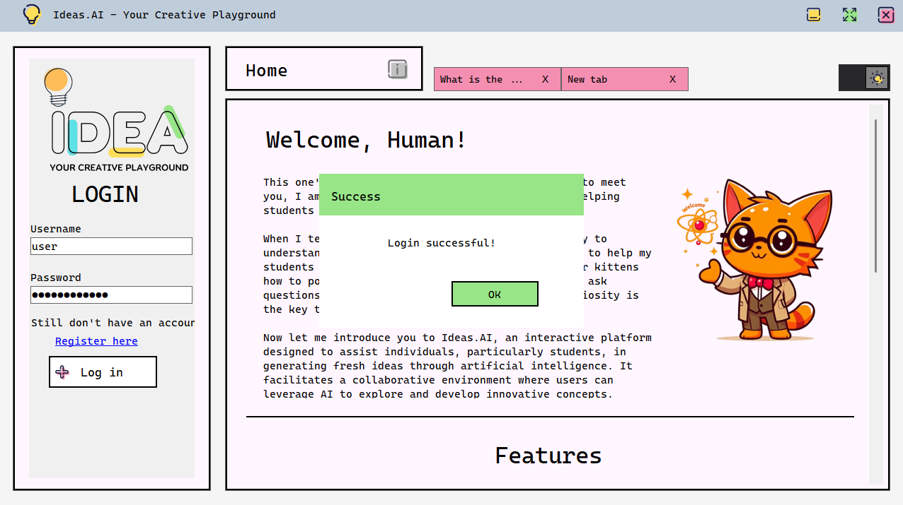
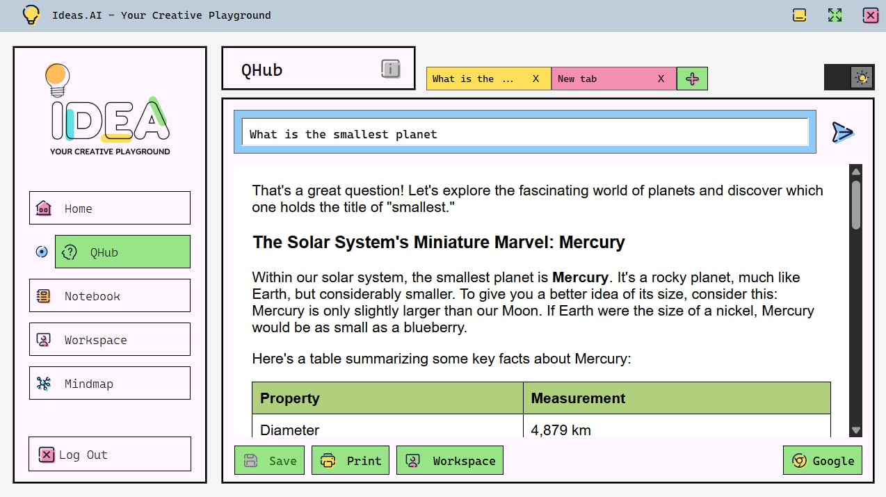
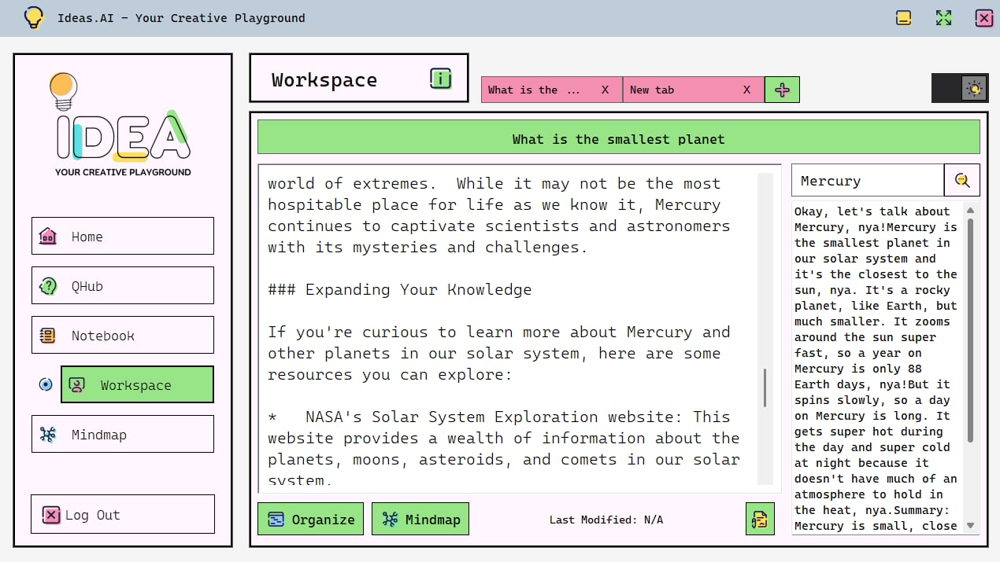
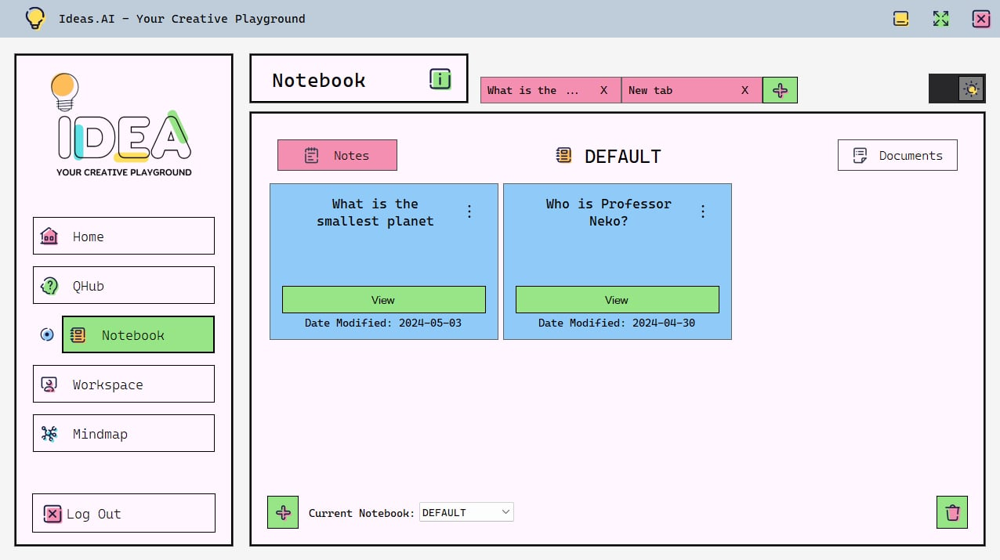
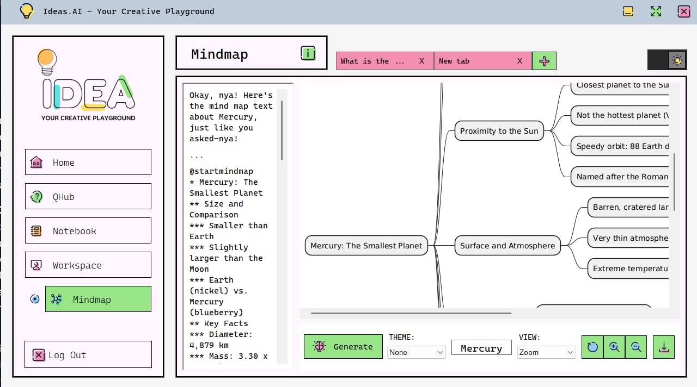

# 💡 IDEA.AI: Your Creative Playground
_Interactive Development and Exploration Assistant_

## I. System Overview

<strong>Idea.AI</strong> is an interactive platform designed to assist individuals, particularly students, in generating fresh ideas through artificial intelligence. It facilitates a collaborative environment where users can leverage AI to explore and develop innovative concepts.

👉 [Download the App here!](https://drive.google.com/drive/u/1/folders/1JvOqooKC-B-Qq9rbWJcoc64LmKh7Swrz)

---

## II. Team Members :
- Dimagculang, Sherivic Mae 
- Ebora, Ma. Mikaella 
- Espina, Lance Andrei 
- Lejano, Nathaniel 
- Tolentino, John Benedict 

## With Special Thanks to the Original Developers :
- Caguicla, Fhil Joshua
- Campued, Maryflor
- Dimagculang, Sherivic Mae
- Gamilla, Marc Juaren

---

## III. Statement of the Problem 

In educational settings, it is very common for students to face difficulties in thinking of ideas and understanding complex topics. With the growing demand for tools that support independent learning and ideation, there is a need for an intelligent, accessible, and user-friendly tool that can assist students with ease.

Idea.AI aims to address this gap by offering an AI-powered chatbot that leverages the Gemini API to help users, particularly students, generate ideas, explore topics, and enhance their learning experience through AI interaction.

---

## IV. Objectives 

- To minimize the difficulties encountered by students when manually generating ideas.
- To enhance the critical and creative thinking skills of the students.
- To evaluate and compare the effectiveness of the system compared to manual idea-generation techniques.
- To design and develop an AI-powered idea suggestion system prototype.

---

## V. Relevance to SDG

 Idea.AI promotes <strong>SDG 4 — Quality Education</strong> by using AI to enhance critical thinking and creativity among students. It offers a platform for collaborative idea generation, breaking down learning barriers and fostering personalized learning experiences. By democratizing idea generation and encouraging lifelong learning, Idea.AI advances the goals of SDG 4.

---

## VI. Significance of the Developed System 

### 🎓 The Students 

The developed system is a lightweight system that offers efficient processes which can assist in enhancing critical and creative thinking skills of the students. It is equipped with the tools and skills necessary to thrive in today’s fast-paced environment.

### 👩‍🏫 The Educators 

This will enable them to comprehend students' academic difficulties more clearly and support in resolving them, particularly when they are given tasks. It will help to improve and refine teaching strategies that are appropriate for the media-filled world of today.

### 🧪 Future Researchers & Developers 

This research can be a useful reference for future researchers, especially, those who are in the field of Computer Science. It will serve as a guide for conducting research related to the developed system, serving as a foundation for new studies or enhancements to existing ones.

### 🏛️ University 

The developed system will help the university in several ways, including improved teaching strategies, more engaged and productive students, and the possibility of technological innovation.

---

## VII. Technology Stack 

- **Programming Language:** C#
- **Software Framework:** Microsoft .NET
- **System Design Pattern:** Builder design pattern
- **System Development Methodology:** Rapid Application Development

## Gemini AI 

Gemini, developed by <strong>Google DeepMind</strong>, stands out as a groundbreaking multimodal language model capable of processing diverse information types, such as text, code, audio, images, and video. With three optimized versions tailored to different needs, Gemini offers versatility for various tasks and devices.

---

## IX. Features

### 🔍 QHub
  
This is the <strong>"Ask a Question"</strong> feature that serves a two-fold purpose. First, it allows the users to consult on the AI Model and get a tailored response based on the prompt. And the other purpose is to use Google, enabling users to ask specific questions which can cover up for the limitations of the generated AI Responses.

### 📝 Notebook
  
The <strong>"Idea Storage"</strong> feature is like a digital notebook tailored for brainstorming and development. It lets users capture, organize, and revisit ideas alongside AI-generated insights. This central hub prevents idea loss, supports comparison with AI outputs, and promotes a productive environment for ongoing projects.

### 🛠️ Workspace
  
The program incorporates a crucial <strong>"Workspace"</strong> feature designed to be a digital playground for expanding ideas. This serves as a central hub for users to brainstorm, refine, and develop their initial concepts. Workspace allows users to write down their ideas in various formats such as text and mind maps. They can freely add notes, organize their thoughts, and connect related concepts.

### 🧠 MindMap
  
The program offers an <strong>"Automatic Mind Map"</strong> feature designed to streamline brainstorming and visualize ideas by transforming raw concepts into a clear, structured format. It supports studies on information overload by assisting in information organization. To use it, users input notes or documents into the system, and AI algorithms generate a tailored mind map, aiding in understanding, retention, and decision-making. Users can then manage study materials, streamline learning, and achieve academic success.

---
## X. User Guide: How to Use the Program

This guide outlines how to use the system’s key features: **QHub**, **Workspace**, **Notebook**, and **MindMap**. Each module is designed to support idea generation, development, and visualization through a seamless and structured workflow.

### Step 1: Login to the System

Before accessing any feature, you must log in to your Idea.AI account.

#### ✅ How to Log In:
1. Launch the application.
2. Enter your **username** and **password**.
3. Click **Login**.
4. Once logged in, you'll be directed to the **Home** screen where you can begin using the system.

### Step 2: Generate Ideas Using QHub

**QHub** is the system’s intelligent query interface. It allows users to ask questions and receive helpful responses via:

- **AI Assistant** – Powered by an integrated AI model (ProfessorNeko) to generate tailored responses.

#### ✅ How to Use:
1. Go to the **QHub** section.
2. Enter your question or idea in the input box.
3. Click **Submit**.
4. Review the results.
   
### Step 3: Refine Ideas in the Workspace

The **Workspace** provides a creative environment for developing and expanding ideas saved from QHub or created manually.

#### ✨ Features:
- Rich text editing support.
- Add and structure content freely.
- Link related ideas and documents.

#### ✅ How to Use:
1. Navigate to the **Workspace** section.
2. Choose to:
   - Open the recent search to Workspace (by clicking Workspace button on QHub)
   - Create a new workspace entry.
   - Open an existing note from Notebook.
4. Edit content using the text editor.
5. Changes are saved automatically.

### Step 4: Organize Your Work in the Notebook

The **Notebook** is where all your generated or manually written ideas are stored and organized.

#### ✨ Features:
- View all saved ideas , notes and documents.
- Search and organize with ease.
- Create, update, or delete notes.

  

#### ✅ How to Use:
1. Open the **Notebook** section.
2. Browse notes from Notebook Tab.
3. Browse docuements from Documents Tab.
4. Click any note/document to:
   - View details.
   - Edit content.
   - Delete if necessary.
5. Use **Quick Search** to find content instantly.

### Step 5: Visualize Concepts with MindMap

The **MindMap** feature transforms your notes into interactive diagrams for better clarity and structure.

#### ✨ Features:
- Automatically generate mind maps from notes.
- Customize node structure and appearance.
- Export visual diagrams for sharing.

  

#### ✅ How to Use:
1. From **Notebook** or **Workspace**, select a note.
2. Click **Generate MindMap**.
3. Review and edit the auto-generated map.
4. Add, remove, or link nodes.
5. Save or export the final mind map.

---
## XI. Conclusion 

The developed system shows the transformational potential of an AI-driven system whose purpose is to help students develop ideas within educational contexts. QHub, Notebook, Workspace, and Mindmap show how AI can be effectively incorporated into educational processes to encourage students in critical and creative thinking.

The developed system improves system speed, user experience, and utilizes AI technology, opening the door for dynamic and engaging learning environments.

Thank You! 

--- 
## XI. Acknowledgement

The Idea.AI Team would like to sincerely express our gratitude to our professor and course facilitator, <strong>Ms. Fatima Marie P. Agdon 🌸✨</strong>,  for her continued guidance, lectures, and feedbacks since the beginning. Her teachings and encouragement are vital to the production and development of our application.

